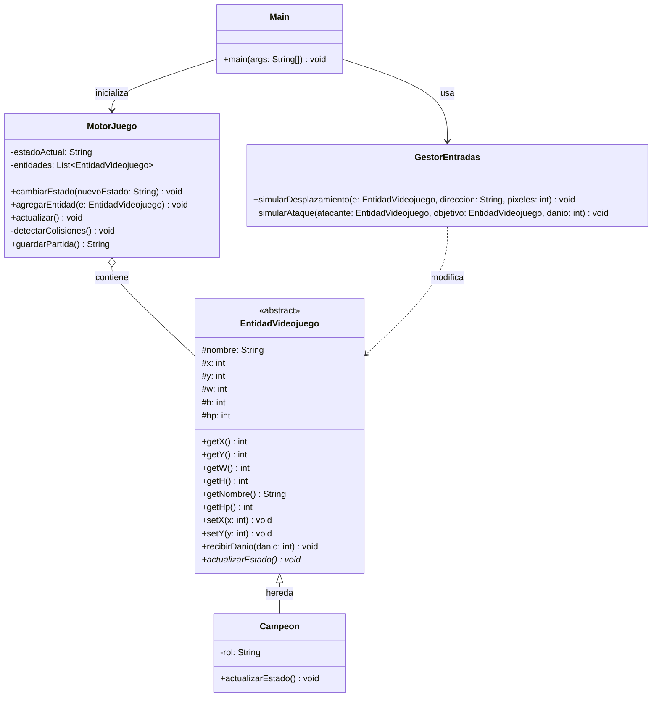

# Mini-Motor 2D: Grieta del Invocador Demake
**Autor:** Maikol Rojas

## 1. Título y Temática Elegida
El proyecto es la lógica interna de un motor 2D basado en un "demake" de League of Legends. El sistema permite gestionar campeones en un mapa cuadriculado, controlar sus estados, simular el movimiento, detectar colisiones simples entre personajes y realizar guardados rápidos del estado de la partida en formato JSON simulado.

## 2. Arquitectura del Software
Se ha optado por un diseño minimalista orientado a objetos con 5 clases, respetando el límite establecido:
* **Main**: Punto de entrada que simula la ejecución del programa y las acciones del jugador por consola.
* **MotorJuego**: Clase controladora central que gestiona el `Game Loop`, la colección de entidades, los estados de la partida y lógicas avanzadas (colisiones y guardado).
* **EntidadVideojuego**: Clase abstracta que define las propiedades físicas y de estado de cualquier objeto en pantalla (coordenadas, tamaño, puntos de vida).
* **Campeon**: Clase concreta que hereda de `EntidadVideojuego`, añadiendo roles específicos y comportamientos de actualización.
* **GestorEntradas**: Clase encargada de traducir los comandos del usuario en acciones dentro del juego (movimiento, ataques).

## 3. Diagrama de Clases UML


```flowchart LR
    Jugador([Jugador])
    UC1(Iniciar Partida)
    UC2(Mover Campeón)
    UC3(Atacar Enemigo)
    UC4(Guardar Partida Rápida)
    
    Jugador --> UC1
    Jugador --> UC2
    Jugador --> UC3
    Jugador --> UC4
```
## 5. Especificación de Casos de Uso

**Caso de Uso 1**
| Campo | Descripción |
| :--- | :--- |
| **Nombre** | CU-01 Mover Campeón |
| **Objetivo** | Desplazar a un campeón por las coordenadas del mapa. |
| **Actor Principal** | Jugador |
| **Precondiciones** | El estado de `MotorJuego` debe ser "JUGANDO" y la entidad debe existir en la lista. |
| **Flujo Principal** | 1. El jugador emite un comando de dirección. <br> 2. `GestorEntradas` intercepta el comando. <br> 3. Se actualizan las coordenadas (x, y) de la entidad. <br> 4. `MotorJuego` verifica colisiones. |

**Caso de Uso 2**
| Campo | Descripción |
| :--- | :--- |
| **Nombre** | CU-02 Guardar Partida Rápida |
| **Objetivo** | Exportar el estado actual de las entidades y el motor para no perder el progreso. |
| **Actor Principal** | Jugador |
| **Precondiciones** | El juego debe estar inicializado y tener entidades cargadas. |
| **Flujo Principal** | 1. El jugador solicita guardar. <br> 2. `MotorJuego` recopila el estado actual ("JUGANDO", etc.). <br> 3. Se formatea la información a un String estructurado (JSON simulado). <br> 4. Se imprime el resultado. |

## 6. Bitácora del Uso de Inteligencia Artificial

* **Herramienta utilizada:** Gemini (Google). Rol: Asistente de codificación en Java.
* **Control de Errores de la IA:** Durante el diseño de la arquitectura inicial, la IA cometió el error de sobre-ingeniería intentando generar clases separadas para renderizado y audio. Tuve que corregir esto manualmente mediante prompts restrictivos para unificar las lógicas dentro de las clases permitidas y no superar el límite estricto de 6 clases de la tarea.
* **Reflexión Crítica:** Programar un motor asistido por IA agiliza la creación de código repetitivo y estructuras iniciales. Sin embargo, exige que el desarrollador actúe como un revisor técnico estricto para asegurar que el modelo respete las limitaciones impuestas por la rúbrica y no genere estructuras innecesarias.
